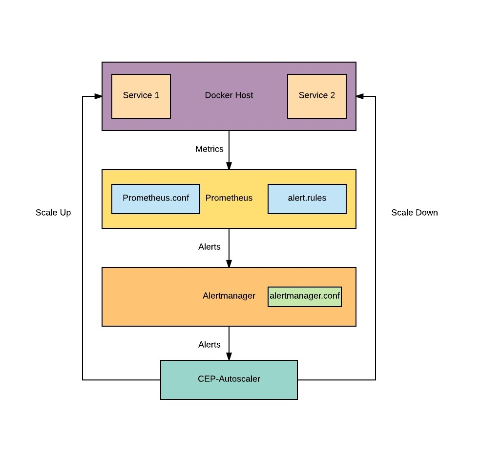

## Introduction

Autoscaling is a method used in cloud computing, whereby the amount of computational resources in a server farm, typically measured in terms of the number of active servers, scales automatically based on the load on the farm.
In our case, the "server" is the application running in a Docker container, and autoscaling here refers to manipulating the number of running docker containers in a Docker Service based on various load parameters such as CPU usage, memory, etc.

It is part of [CEP](https://github.com/EdgeVerve/cep-provision) installation which takes care of configuration and deployment of this component. It can be used outside CEP provided infrastructure has necessary monitoring setup based on prometheus/alertmanager.

## Need for custom autoscaling module

Unlike other orchestration providers such as Openshift, Docker does not provide a builtin way to autoscale. Hence, in the specific case of Docker deployment, we have built a basic autoscaling framework.

## High level Block Diagram




## Architecture

The CEP autoscaling is based on a combination of off-the-shelf OSS and a custom component, hence forth referred to as CEP-Autoscaler.

The components used in CEP Autoscaling are as follows:

1. *Prometheus* - The open-source software Prometheus ([main site](https://prometheus.io/), [docker-prometheus](https://docs.docker.com/engine/admin/prometheus/)) is a systems monitoring and alerting toolkit. In CEP, we use the [official Prometheus Docker Image](https://hub.docker.com/r/prom/prometheus/) to run Prometheus. 

2. *Alertmanager* - The open-source software Alertmanager ([Github](https://github.com/prometheus/alertmanager)) handles alerts sent by client applications such as the Prometheus server. It takes care of deduplicating, grouping, and routing them to the correct receiver integration such as email, webhook, etc., It also takes care of silencing and inhibition of alerts. In CEP, we use the [official AlertManager Docker Image](https://hub.docker.com/r/prom/alertmanager/)  to run Alertmanager.

3. *CEP-Autoscaler* - This CEP custom component is a NodeJS based application packaged as a Docker image. 

Docker used in CEP is configured as a Prometheus target. This is configured by means of a prometheus.conf file. (See sample prometheus.conf file [here](./prometheus.conf)). This enables the monitoring of the Docker daemon. Alert rules (See sample alert.rules [here](./alert.rules)) are defined in Prometheus to send(POST) metrics query results to Alertmanager whenever specified conditions are met. For example, the rule can specify that a high memory condition should persist for at least 10 minutes before an alert regarding the same is sent to Alertmanager.

Alertmanager forwards the alerts it receives to the configured webhook URL. (see sample alertmanager.conf [here](./alertmanager.conf)). This config specifies the timing and method of alerting downstream component(s). The timing involves throttling of repeated alerts. In our case, we use the webhook method, where we setup a URL hosted by the CEP-Autoscaler. Thus the Alertmanager sends alerts to the CEP-Autoscaler.   

The CEP-Autoscaler receives the alerts meeting the set limits of CPU and memory and timing requirements. It decides whether these alerts require any action in terms of scale-up or scale-down based on hard limits on CPU and memory. These hard limits are setup as part of the application stack (Labels in [docker-compose.yml](./docker-compose-app-cpu.yml)). If a hard limit is crossed, the CEP-Autoscaler will scale the relevant service(s) up or down.


### Docker-compose.yml configuration

The hard limits are to be setup as Labels in the docker-compose file under the specific service tht needs autoscaling. 
Some additional labels are also required for autoscaling to work. These are explained below:

```
      service.autoscale.up.count: 1        # Number in instances to scale up in one step
      service.autoscale.up.cpu: 85         # Upper threshold of CPU percentage to trigger a scale-up
      service.autoscale.up.instances: 8    # Max instances for scale-up
      service.autoscale.up.memory: 90      # Upper threshold of Memory percentage to trigger a scale-up
      service.autoscale.down.count: 1      # Number in instances to scale down in one step
      service.autoscale.down.cpu: 20       # Lower threshold of CPU percentage to trigger a scale-down
      service.autoscale.down.memory: 25    # Lower threshold of Memory percentage to trigger a scale-down
      service.autoscale.down.instances: 2  # Min instances to scale-down to

```

Also autoscaler needs your applications to have constraint on cpu or/and memory depending on which metrics application needs to be scaled. For example:

```
    resources:
        limits:
          cpus: '0.25'
          memory: 512M

```

See the following for a complete example [docker-compose.yml](./docker-compose-app.yml) file:

Also setting up auto-scaling for both memory and cpu on the same application is not recommended as it may cause a [tug of war](https://en.wikipedia.org/wiki/Tug_of_war) between two metrics!

### Alertmanager.conf

See the following for a sample [Alertmanager.conf](./alertmanager.conf) file

### Alert Rules

See sample [alert.rules](./alert.rules)

## More information
Please visit [oeCloud.io](https://www.oecloud.io)

## License
The project is licensed under MIT License, See [LICENSE](./LICENSE) for more details.

## Contributing
We welcome contributions. Some of the best ways to contribute are to try things out, file bugs, and join in design conversations. 

### [How to contribute](./CONTRIBUTION.md)

### [Report an issue](https://github.com/EdgeVerve/cep-auto-scaler/issues)

